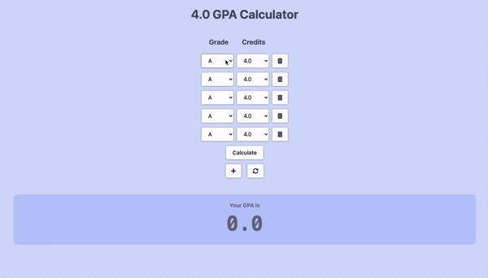

# GPA Calculator
> A GPA Calculator made using Vanilla JS and Tailwind CSS.
> 

## Usage
>Enter in course grades to calculate GPA on a 4.0 scale.
>(Based on American University of Nigeria grading scale)

## Features
* Delete and add more columns (max of 10)
* Grade scale with academic standing.

(https://distracted-jepsen-cf513e.netlify.app)
